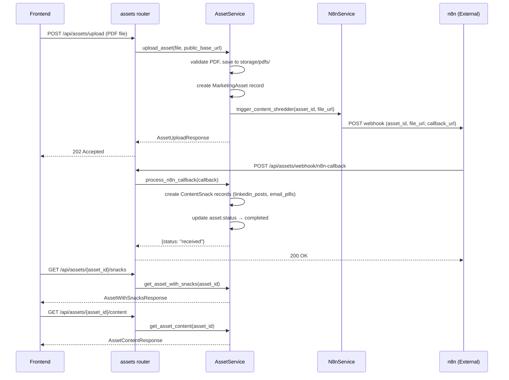
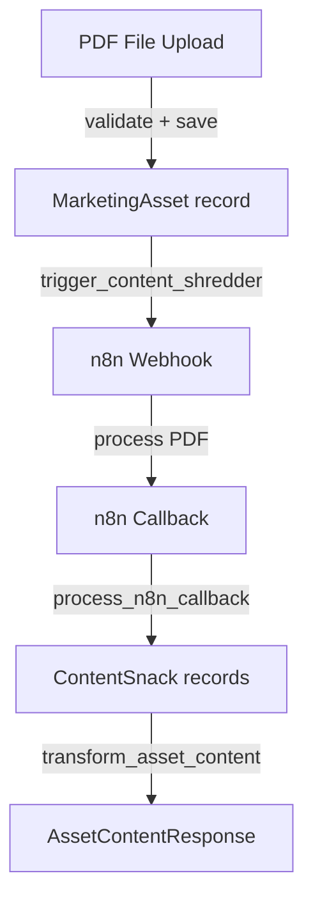
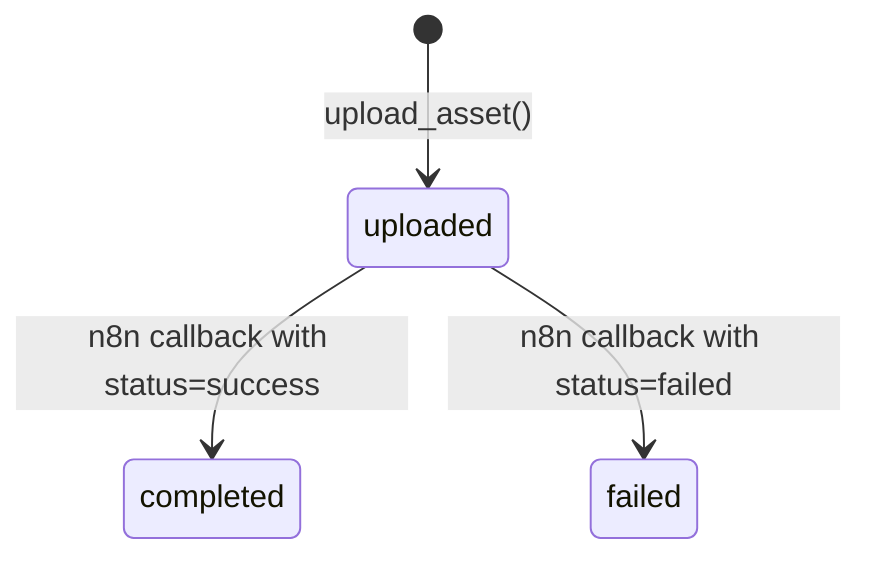

# Content Pipeline — API Contract

> Upload PDF marketing assets, trigger n8n content shredder for automated content extraction, receive LinkedIn posts and email pills via callback, and serve structured content to the frontend.

## 1. Web Overview

This pipeline handles the "content recycling" workflow. When a user uploads a PDF marketing asset, the system saves the file, creates a `MarketingAsset` record, and triggers an n8n webhook to shred the PDF into reusable content pieces. n8n processes the PDF asynchronously and sends back a callback with LinkedIn posts and email pills. These are stored as `ContentSnack` records linked to the original asset.



---

## 2. Service Inventory

### AssetService

I am **AssetService**. I handle the full lifecycle of marketing assets — from PDF upload through content extraction. I validate uploaded files, save them to disk with sequential naming, create database records, trigger the n8n content shredder, process n8n callbacks to create `ContentSnack` records, and serve asset data with associated content to the frontend.

| Property       | Value                                          |
|----------------|------------------------------------------------|
| Location       | [`backend/app/services/asset_service.py`](../services/asset_service.py) |
| Dependencies   | `N8nService`, `app.transformers.content`       |
| Initialization | Requires `AsyncSession` (database session)     |

**Methods I expose:**
- `upload_asset(file: UploadFile, public_base_url: str) -> Tuple[MarketingAsset, AssetUploadResponse]` — Upload PDF and trigger n8n
- `process_n8n_callback(callback: N8nShredderCallback) -> dict` — Process n8n callback and create ContentSnacks
- `get_asset_with_snacks(asset_id: str) -> AssetWithSnacksResponse` — Get asset with all content snacks
- `get_asset_content(asset_id: str) -> AssetContentResponse` — Get cleaned content for an asset

---

### N8nService

I am **N8nService**. I trigger the n8n content shredder webhook. I take an asset_id and file_url, build a callback URL, and POST to n8n's webhook endpoint. I am fire-and-forget — if the webhook fails, I return an error status but do not crash the server.

| Property       | Value                                          |
|----------------|------------------------------------------------|
| Location       | [`backend/app/services/n8n_service.py`](../services/n8n_service.py) |
| Dependencies   | None (uses `app.core.config` for settings)     |
| Initialization | Stateless — instantiated with no arguments     |

**Methods I expose:**
- `trigger_content_shredder(asset_id: UUID, file_url: str) -> Dict[str, Any]` — Trigger n8n content shredder webhook

---

## 3. Internal API Contracts

### AssetService → N8nService.trigger_content_shredder()

**Purpose:** Trigger the n8n content shredder webhook to process a newly uploaded PDF.

**Input:**

| Parameter | Type   | Required | Description                              |
|-----------|--------|----------|------------------------------------------|
| asset_id  | UUID   | Yes      | Unique identifier for the marketing asset|
| file_url  | str    | Yes      | Full URL to the PDF file for processing  |

**Output:** `Dict[str, Any]`

| Field    | Type   | Description                                      |
|----------|--------|--------------------------------------------------|
| status   | string | "webhook_triggered" or "webhook_failed"          |
| asset_id | string | The asset UUID as string                         |
| message  | string | Human-readable status message                    |
| error    | string | Error details (only present if status=failed)    |

**Preconditions:**
- Asset must have been saved to database and disk before calling
- `file_url` must be a fully qualified URL (constructed using `public_base_url`)

**Errors:**
- N8nService does NOT raise exceptions — it returns a dict with `status: "webhook_failed"` on network errors

---

### AssetService → `transform_asset_content()` (via transformers)

**Purpose:** Transform a list of ContentSnack model instances into a clean, structured AssetContentResponse.

**Input:**

| Parameter      | Type              | Required | Description                          |
|----------------|-------------------|----------|--------------------------------------|
| asset_id       | UUID              | Yes      | The UUID of the marketing asset      |
| content_items  | List[ContentSnack]| Yes      | ContentSnack model instances from DB |

**Output:** [`AssetContentResponse`](../schemas/content.py)

| Field               | Type                       | Description                              |
|---------------------|----------------------------|------------------------------------------|
| asset_id            | string (UUID)              | Unique identifier for the marketing asset|
| content_items       | List[ContentSnackResponse] | List of content items                    |
| total_count         | int                        | Total number of content items            |
| linkedin_post_count | int                        | Number of LinkedIn posts                 |
| email_pill_count    | int                        | Number of email pills                    |

**ContentSnackResponse:**

| Field        | Type              | Description                              |
|--------------|-------------------|------------------------------------------|
| id           | string (UUID)     | Unique identifier for the content snack  |
| asset_id     | string (UUID)     | Parent asset identifier                  |
| content_type | string            | "linkedin_post" or "email_pill"          |
| content_text | string            | The actual content text                  |
| metadata     | object \| null    | Additional metadata (hashtags, etc.)     |
| created_at   | string (ISO8601)  | Creation timestamp                       |
| updated_at   | string (ISO8601)  | Last update timestamp                    |

---

## 4. External API Contracts (HTTP Endpoints)

### `POST /api/assets/upload`

> Upload a PDF asset and trigger the n8n content shredder webhook.

**Request:**

| Parameter | Location | Type       | Required | Description          |
|-----------|----------|------------|----------|----------------------|
| file      | body     | UploadFile | Yes      | PDF file to upload   |

**Success Response:** `202 Accepted`

```json
{
  "asset_id": "550e8400-e29b-41d4-a716-446655440000",
  "filename": "001.pdf",
  "original_filename": "brand-guidelines.pdf",
  "sequence_number": 1,
  "storage_url": "/storage/pdfs/001.pdf",
  "status": "uploaded",
  "message": "PDF uploaded successfully and content shredder webhook triggered"
}
```

| Field            | Type              | Description                              |
|------------------|-------------------|------------------------------------------|
| asset_id         | string (UUID)     | Unique identifier for the uploaded asset |
| filename         | string            | Sequential filename (e.g., "001.pdf")    |
| original_filename| string \| null    | Original filename before renaming        |
| sequence_number  | int \| null       | Sequential number for file naming        |
| storage_url      | string            | Storage URL path                         |
| status           | string            | "uploaded"                               |
| message          | string            | Upload status message                    |

**Error Responses:**

| Status | Condition                    | Detail Pattern                              |
|--------|------------------------------|---------------------------------------------|
| 400    | File is not a PDF            | "Only PDF files are allowed"                |
| 500    | File save fails              | "Failed to save file: {error}"              |
| 500    | Database operation fails     | "Failed to upload asset: {error}"           |

**Background Behavior:** The n8n webhook is triggered synchronously during the request. If n8n is unreachable, the upload still succeeds — the error is logged but the asset is saved. The frontend should poll `GET /api/assets/{asset_id}/snacks` to check when content arrives.

---

### `POST /api/assets/webhook/n8n-callback`

> Receive callback from n8n content shredder with processing results.

**Request:**

| Parameter      | Location | Type     | Required | Description                              |
|----------------|----------|----------|----------|------------------------------------------|
| asset_id       | body     | UUID     | Yes      | Unique identifier for the marketing asset|
| status         | body     | str      | Yes      | Callback status: "success" or "failed"   |
| linkedin_posts | body     | List[str]| No       | List of LinkedIn post content strings    |
| email_pills    | body     | List[str]| No       | List of email pill content strings       |

**Success Response:** `200 OK`

```json
{
  "status": "received"
}
```

| Field  | Type   | Description |
|--------|--------|-------------|
| status | string | "received"  |

**Error Responses:**

| Status | Condition              | Detail Pattern                          |
|--------|------------------------|-----------------------------------------|
| 404    | Asset not found        | "Asset with ID {asset_id} not found"    |
| 500    | Database operation fails| "Failed to process n8n callback: {error}"|

**Side Effects:**
- If `status == "success"`: Creates `ContentSnack` records for each LinkedIn post and email pill, then sets `asset.status = "completed"`
- If `status == "failed"`: Sets `asset.status = "failed"`

---

### `GET /api/assets/{asset_id}/snacks`

> Retrieve a marketing asset along with all its associated content snacks.

**Request:**

| Parameter | Location | Type | Required | Description          |
|-----------|----------|------|----------|----------------------|
| asset_id  | path     | str  | Yes      | Asset UUID (string)  |

**Success Response:** `200 OK`

| Field  | Type                        | Description                    |
|--------|-----------------------------|--------------------------------|
| asset  | MarketingAssetResponse      | Marketing asset data           |
| snacks | List[ContentSnackResponse]  | List of content snacks         |

**MarketingAssetResponse:**

| Field            | Type              | Description                              |
|------------------|-------------------|------------------------------------------|
| id               | string (UUID)     | Unique identifier                        |
| filename         | string            | Sequential filename (e.g., "001.pdf")    |
| original_filename| string \| null    | Original filename before renaming        |
| sequence_number  | int \| null       | Sequential number for file naming        |
| storage_url      | string            | Storage URL path                         |
| status           | string            | "uploaded", "completed", or "failed"     |
| webhook_payload  | object \| null    | Webhook callback data                    |
| created_at       | string (ISO8601)  | Creation timestamp                       |
| updated_at       | string (ISO8601)  | Last update timestamp                    |

**Error Responses:**

| Status | Condition              | Detail Pattern                          |
|--------|------------------------|-----------------------------------------|
| 400    | Invalid UUID format    | "Invalid asset ID format: {asset_id}"   |
| 404    | Asset not found        | "Asset with ID {asset_id} not found"    |
| 500    | Database query fails   | "Failed to retrieve asset with snacks: {error}" |

---

### `GET /api/assets/{asset_id}/content`

> Get cleaned content for a specific asset in a structured format.

**Request:**

| Parameter | Location | Type | Required | Description          |
|-----------|----------|------|----------|----------------------|
| asset_id  | path     | str  | Yes      | Asset UUID (string)  |

**Success Response:** `200 OK`

Returns [`AssetContentResponse`](../schemas/content.py):

| Field               | Type                       | Description                              |
|---------------------|----------------------------|------------------------------------------|
| asset_id            | string (UUID)              | Unique identifier for the marketing asset|
| content_items       | List[ContentSnackResponse] | List of content items                    |
| total_count         | int                        | Total number of content items            |
| linkedin_post_count | int                        | Number of LinkedIn posts                 |
| email_pill_count    | int                        | Number of email pills                    |

**Error Responses:**

| Status | Condition              | Detail Pattern                              |
|--------|------------------------|---------------------------------------------|
| 400    | Invalid UUID format    | "Invalid asset_id format: {asset_id}"       |
| 404    | Asset not found        | "Asset with ID {asset_id} not found"        |
| 500    | Database query fails   | "Failed to retrieve asset content: {error}" |

---

## 5. Data Flow

### Step-by-step transformation narrative

1. **PDF Upload** — Frontend sends a multipart file upload to `POST /api/assets/upload`. The file is validated as PDF, saved to `storage/pdfs/{sequence}.pdf`, and a `MarketingAsset` record is created with `status="uploaded"`.

2. **n8n Trigger** — `N8nService.trigger_content_shredder()` sends the asset_id and file_url to n8n's webhook. n8n processes the PDF asynchronously.

3. **n8n Callback** — n8n POSTs to `/api/assets/webhook/n8n-callback` with `status="success"`, `linkedin_posts: [...]`, and `email_pills: [...]`. Each string becomes a `ContentSnack` record with `content_type` set to "linkedin_post" or "email_pill".

4. **Content Retrieval** — `GET /api/assets/{asset_id}/snacks` returns the raw `MarketingAsset` and all `ContentSnack` records. `GET /api/assets/{asset_id}/content` transforms the snacks through `transform_asset_content()` into a clean `AssetContentResponse` with counts.



---

## 6. Status State Machine

### MarketingAsset Status Machine



| From State | To State  | Trigger                                    | Actor              |
|------------|-----------|--------------------------------------------|--------------------|
| (created)  | uploaded  | `upload_asset()` called                    | AssetService       |
| uploaded   | completed | n8n callback received with `status="success"` | AssetService (process_n8n_callback) |
| uploaded   | failed    | n8n callback received with `status="failed"`  | AssetService (process_n8n_callback) |

**Note:** There is no transition from `completed` or `failed` back to any other state. The asset lifecycle is one-directional.

---

## 7. Error Contracts

### AssetService Errors

I raise the following errors:

| Status | Condition                    | Detail Pattern                                              | Propagates To |
|--------|------------------------------|-------------------------------------------------------------|---------------|
| 400    | File is not a PDF            | "Only PDF files are allowed"                                | HTTP response |
| 400    | Invalid UUID format          | "Invalid asset ID format: {asset_id}"                       | HTTP response |
| 400    | Invalid asset_id format      | "Invalid asset_id format: {asset_id}"                       | HTTP response |
| 404    | Asset not found              | "Asset with ID {asset_id} not found"                        | HTTP response |
| 500    | File save fails              | "Failed to save file: {error}"                              | HTTP response |
| 500    | Database operation fails     | "Failed to upload asset: {error}"                           | HTTP response |
| 500    | n8n callback processing fails| "Failed to process n8n callback: {error}"                   | HTTP response |
| 500    | Asset retrieval fails        | "Failed to retrieve asset with snacks: {error}"             | HTTP response |
| 500    | Content retrieval fails      | "Failed to retrieve asset content: {error}"                 | HTTP response |

---

### N8nService Errors

I do NOT raise exceptions. I return error dicts:

| Condition                    | Response                                                      |
|------------------------------|---------------------------------------------------------------|
| Network/timeout error        | `{ "status": "webhook_failed", "error": "Failed to trigger n8n webhook: {error}", "message": "Webhook trigger failed but asset was saved" }` |
| Unexpected error             | `{ "status": "webhook_failed", "error": "Unexpected error triggering n8n webhook: {error}", "message": "Webhook trigger failed but asset was saved" }` |

**Design rationale:** N8nService is fire-and-forget. The asset upload should succeed even if n8n is temporarily unavailable. The error is logged but does not propagate to the HTTP response.

---

## 8. Assumptions and Constraints

| Assumption                        | Detail                                                                                      |
|-----------------------------------|---------------------------------------------------------------------------------------------|
| Database session scoping          | AssetService uses request-scoped `AsyncSession` from `get_db()`. No background tasks create their own sessions. |
| Background task behavior          | The n8n webhook is triggered synchronously during the upload request. If n8n is slow, the upload response may be delayed. The n8n callback is processed synchronously when received. |
| External service dependency       | n8n (content shredder webhook). n8n processes PDFs asynchronously and sends callbacks. |
| File storage                      | PDFs are saved to `storage/pdfs/` with sequential naming (001.pdf, 002.pdf, etc.). The storage directory is served as a static mount at `/storage/pdfs/`. |
| Sequential file naming            | The next sequence number is determined by `MAX(sequence_number) + 1`. If files are deleted, gaps in numbering will exist. |
| Idempotency                       | `POST /api/assets/upload` is NOT idempotent — uploading the same PDF twice creates two assets. `POST /api/assets/webhook/n8n-callback` is NOT idempotent — duplicate callbacks will create duplicate ContentSnacks. |
| Content types                     | ContentSnacks have two types: "linkedin_post" and "email_pill". These are string values, not enums. |
| n8n callback payload              | The `linkedin_posts` and `email_pills` fields are optional in the callback schema (default to empty lists). If n8n sends `status="failed"`, no ContentSnacks are created. |
| Asset deletion                    | Deleting an EnrichmentJob cascades to CampaignSequences. Deleting a MarketingAsset cascades to ContentSnacks (via SQLAlchemy cascade). |
| Timeout behavior                  | n8n webhook has 30-second timeout. If n8n doesn't respond within 30 seconds, the upload still succeeds but the webhook status will be "webhook_failed". |
