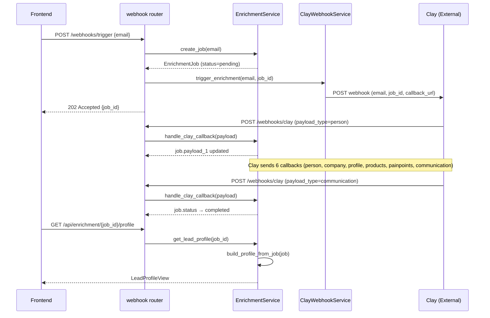
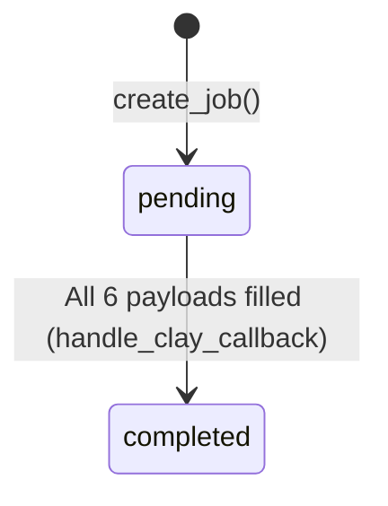

# Enrichment Pipeline — API Contract

> Send an email to Clay for enrichment, receive 6 webhook callbacks with structured data, store them as JSONB payloads, and transform raw payloads into a clean `LeadProfileView` for downstream consumption.

## 1. Web Overview

This pipeline handles the data collection phase of Elogia's outreach engine. When a user triggers enrichment for an email address, the system creates an `EnrichmentJob`, sends the email to Clay's enrichment API, and waits for 6 webhook callbacks (person, company, profile, products, painpoints, communication). Each callback updates a specific JSONB column on the job. When all 6 payloads are filled, the job status transitions to `completed`. The enriched data can then be consumed as raw JSONB payloads or transformed into a structured `LeadProfileView`.



---

## 2. Service Inventory

### ClayWebhookService

I am **ClayWebhookService**. I send outbound webhook requests to Clay's enrichment API. I take an email and job_id, build a callback URL, and POST to Clay's webhook endpoint. I handle network errors and HTTP failures from Clay.

| Property       | Value                                          |
|----------------|------------------------------------------------|
| Location       | [`backend/app/services/clay_service.py`](../services/clay_service.py) |
| Dependencies   | None (uses `app.core.config` for settings)     |
| Initialization | Stateless — instantiated with no arguments     |

**Methods I expose:**
- `trigger_enrichment(email: str, job_id: UUID) -> Dict[str, Any]` — Sends enrichment request to Clay

---

### EnrichmentService

I am **EnrichmentService**. I manage the lifecycle of `EnrichmentJob` records. I process Clay webhook callbacks, dynamically updating the correct JSONB payload column based on `payload_type`. When all 6 payloads are filled, I transition the job status to `completed`. I also transform raw payloads into structured `LeadProfileView` objects via transformers.

| Property       | Value                                          |
|----------------|------------------------------------------------|
| Location       | [`backend/app/services/enrichment_service.py`](../services/enrichment_service.py) |
| Dependencies   | `app.transformers` (for `build_lead_profile`)  |
| Initialization | Requires `AsyncSession` (database session)     |

**Methods I expose:**
- `handle_clay_callback(payload: ClayWebhookPayload) -> EnrichmentJob` — Process Clay webhook callback
- `create_job(email: str) -> EnrichmentJob` — Create a new enrichment job
- `build_profile_from_job(job: EnrichmentJob) -> LeadProfileView` — Transform job into structured profile (static method)
- `get_completed_jobs() -> List[JobSummary]` — Get all completed jobs
- `get_consolidated_payload(job_id: str) -> ConsolidatedPayload` — Get job with all JSONB payloads
- `get_lead_profile(job_id: str) -> LeadProfileView` — Get transformed lead profile

---

## 3. Internal API Contracts

### EnrichmentService → `build_lead_profile()` (via transformers)

**Purpose:** Transform raw JSONB payloads from EnrichmentJob into a structured LeadProfileView for downstream consumption.

**Input:**

| Parameter                | Type           | Required | Description                              |
|--------------------------|----------------|----------|------------------------------------------|
| person_payload           | dict           | Yes      | Raw person data (payload_1)              |
| company_payload          | dict \| None   | No       | Raw company data (payload_2)             |
| role_intelligence_payload| dict \| None   | No       | Raw role intelligence data (payload_3)   |
| product_payload          | dict \| None   | No       | Raw product analysis data (payload_4)    |
| pain_payload             | dict \| None   | No       | Raw pain point analysis data (payload_5) |
| outreach_payload         | dict \| None   | No       | Raw outreach strategy data (payload_6)   |

**Output:** [`LeadProfileView`](../schemas/enriched_data.py)

| Field            | Type                        | Description                              |
|------------------|-----------------------------|------------------------------------------|
| name             | str                         | Full name of the lead                    |
| current_title    | str                         | Current job title                        |
| location         | str                         | Geographic location (city, country)      |
| linkedin_url     | str \| None                 | URL to LinkedIn profile                  |
| headline         | str \| None                 | Professional headline from profile       |
| summary          | str \| None                 | Profile summary or bio                   |
| recent_experience| List[ExperienceView]        | Most recent work experiences             |
| education        | List[EducationView]         | Educational background                   |
| languages        | List[LanguageView]          | Languages spoken                         |
| company          | CompanyView \| None         | Current company details                  |
| intelligence     | RoleIntelligenceView \| None| Deep intelligence about the role         |

**Preconditions:**
- `person_payload` must contain at least `name` and `title` fields

---

## 4. External API Contracts (HTTP Endpoints)

### `POST /webhooks/trigger`

> Initiate Clay enrichment for a given email address.

**Request:**

| Parameter | Location | Type | Required | Description              |
|-----------|----------|------|----------|--------------------------|
| email     | query    | str  | Yes      | Email address to enrich  |

**Success Response:** `202 Accepted`

```json
{
  "status": "accepted",
  "job_id": "550e8400-e29b-41d4-a716-446655440000",
  "email": "user@example.com",
  "message": "Enrichment request accepted and sent to Clay"
}
```

| Field   | Type   | Description                              |
|---------|--------|------------------------------------------|
| status  | string | "accepted"                               |
| job_id  | string | UUID of the created enrichment job       |
| email   | string | The email address being enriched         |
| message | string | Human-readable status message            |

**Error Responses:**

| Status | Condition                    | Detail Pattern                              |
|--------|------------------------------|---------------------------------------------|
| 500    | Job creation fails           | "Failed to initiate enrichment: {error}"    |
| 502    | Clay webhook request fails   | "Clay webhook request failed with status..." |
| 503    | Clay is unreachable          | "Failed to connect to Clay webhook: {error}"|

**Background Behavior:** The Clay webhook request runs as a background task after the 202 response is sent. The frontend should poll `GET /api/enrichment/jobs/{job_id}` to check when payloads arrive.

---

### `POST /webhooks/clay`

> Receive Clay webhook callback with payload and update enrichment job.

**Request:**

| Parameter    | Location | Type   | Required | Description                              |
|--------------|----------|--------|----------|------------------------------------------|
| job_id       | body     | UUID   | Yes      | Job identifier for the enrichment job    |
| email        | body     | str    | Yes      | Email address being enriched             |
| payload_type | body     | str    | Yes      | One of: "person", "company", "profile", "products", "painpoints", "communication" |
| data         | body     | dict   | Yes      | Dynamic payload data from Clay           |

**Success Response:** `200 OK`

```json
{
  "status": "success",
  "job_id": "550e8400-e29b-41d4-a716-446655440000",
  "updated_payload": "person"
}
```

| Field           | Type   | Description                          |
|-----------------|--------|--------------------------------------|
| status          | string | "success"                            |
| job_id          | string | UUID of the updated job              |
| updated_payload | string | Which payload_type was just updated  |

**Error Responses:**

| Status | Condition              | Detail Pattern                                    |
|--------|------------------------|---------------------------------------------------|
| 404    | Job not found          | "Enrichment job with ID {job_id} not found"       |
| 500    | Database update fails  | "Failed to update enrichment job: {error}"        |

---

### `POST /webhooks/clay/trigger/{job_id}`

> Diagnostic/fallback endpoint that creates a synthetic Clay payload for a job.

**Request:**

| Parameter | Location | Type | Required | Description              |
|-----------|----------|------|----------|--------------------------|
| job_id    | path     | str  | Yes      | Job identifier (UUID)    |

**Success Response:** `200 OK`

```json
{
  "status": "success",
  "job_id": "550e8400-e29b-41d4-a716-446655440000",
  "updated_payload": "diagnostic"
}
```

**Error Responses:**

| Status | Condition       | Detail Pattern                      |
|--------|-----------------|-------------------------------------|
| 404    | Job not found   | "Job with ID {job_id} not found"    |
| 500    | Processing fails| "Failed to trigger diagnostic webhook: {error}" |

---

### `GET /api/enrichment/completed`

> Get all completed enrichment jobs for frontend dropdown selection.

**Request:** No parameters.

**Success Response:** `200 OK`

```json
[
  {
    "job_id": "550e8400-e29b-41d4-a716-446655440000",
    "email": "user@example.com",
    "status": "completed"
  }
]
```

| Field   | Type   | Description                    |
|---------|--------|--------------------------------|
| job_id  | string | UUID of the job                |
| email   | string | Email address                  |
| status  | string | "pending" or "completed"       |

**Error Responses:**

| Status | Condition           | Detail Pattern                            |
|--------|---------------------|-------------------------------------------|
| 500    | Database query fails| "Failed to fetch completed jobs: {error}" |

---

### `GET /api/enrichment/{job_id}/payload`

> Get a single job with all its raw JSONB payloads.

**Request:**

| Parameter | Location | Type | Required | Description          |
|-----------|----------|------|----------|----------------------|
| job_id    | path     | str  | Yes      | Job ID (UUID string) |

**Success Response:** `200 OK`

| Field       | Type              | Description                              |
|-------------|-------------------|------------------------------------------|
| job_id      | string (UUID)     | Unique identifier for the job            |
| email       | string            | Email address                            |
| status      | string            | "pending" or "completed"                 |
| payload_1   | object \| null    | Person data                              |
| payload_2   | object \| null    | Company data                             |
| payload_3   | object \| null    | Role intelligence data                   |
| payload_4   | object \| null    | Product analysis data                    |
| payload_5   | object \| null    | Pain point analysis data                 |
| payload_6   | object \| null    | Outreach strategy data                   |
| created_at  | string (ISO8601)  | Creation timestamp                       |
| updated_at  | string (ISO8601)  | Last update timestamp                    |

**Error Responses:**

| Status | Condition           | Detail Pattern                            |
|--------|---------------------|-------------------------------------------|
| 400    | Invalid UUID format | "Invalid job ID format: {job_id}"         |
| 404    | Job not found       | "Enrichment job with ID {job_id} not found" |
| 500    | Database query fails| "Failed to fetch job payload: {error}"    |

---

### `GET /api/enrichment/{job_id}/profile`

> Get transformed lead profile for a job (clean, structured data).

**Request:**

| Parameter | Location | Type | Required | Description          |
|-----------|----------|------|----------|----------------------|
| job_id    | path     | str  | Yes      | Job ID (UUID string) |

**Success Response:** `200 OK`

Returns a [`LeadProfileView`](../schemas/enriched_data.py) object with nested `CompanyView`, `RoleIntelligenceView`, and arrays of `ExperienceView`, `EducationView`, `LanguageView`.

**Error Responses:**

| Status | Condition           | Detail Pattern                            |
|--------|---------------------|-------------------------------------------|
| 400    | Invalid UUID format | "Invalid job ID format: {job_id}"         |
| 404    | Job not found       | "Enrichment job with ID {job_id} not found" |
| 500    | Transformation fails| "Failed to fetch lead profile: {error}"   |

---

### `GET /api/enrichment/jobs/{job_id}`

> Get a specific enrichment job by UUID.

**Request:**

| Parameter | Location | Type     | Required | Description          |
|-----------|----------|----------|----------|----------------------|
| job_id    | path     | UUID     | Yes      | Job UUID             |

**Success Response:** `200 OK`

Returns `EnrichmentJobResponse` with all fields including `payload_1` through `payload_6`.

**Error Responses:**

| Status | Condition     | Detail Pattern                      |
|--------|---------------|-------------------------------------|
| 404    | Job not found | "Job with ID {job_id} not found"    |

---

### `PUT /api/enrichment/jobs/{job_id}`

> Update an existing enrichment job's fields.

**Request:**

| Parameter  | Location | Type              | Required | Description                    |
|------------|----------|-------------------|----------|--------------------------------|
| job_id     | path     | UUID              | Yes      | Job UUID                       |
| status     | body     | str \| null       | No       | Updated status                 |
| payload_1  | body     | object \| null    | No       | Updated first payload          |
| payload_2  | body     | object \| null    | No       | Updated second payload         |
| payload_3  | body     | object \| null    | No       | Updated third payload          |
| payload_4  | body     | object \| null    | No       | Updated fourth payload         |
| payload_5  | body     | object \| null    | No       | Updated fifth payload          |
| payload_6  | body     | object \| null    | No       | Updated sixth payload          |

**Success Response:** `200 OK`

Returns updated `EnrichmentJobResponse`.

**Error Responses:**

| Status | Condition           | Detail Pattern                      |
|--------|---------------------|-------------------------------------|
| 404    | Job not found       | "Job with ID {job_id} not found"    |
| 500    | Update fails        | "Failed to update job: {error}"     |

---

### `DELETE /api/enrichment/jobs/{job_id}`

> Delete an enrichment job by UUID.

**Request:**

| Parameter | Location | Type | Required | Description |
|-----------|----------|------|----------|-------------|
| job_id    | path     | UUID | Yes      | Job UUID    |

**Success Response:** `204 No Content`

**Error Responses:**

| Status | Condition           | Detail Pattern                      |
|--------|---------------------|-------------------------------------|
| 404    | Job not found       | "Job with ID {job_id} not found"    |
| 500    | Deletion fails      | "Failed to delete job: {error}"     |

---

## 5. Data Flow

### Step-by-step transformation narrative

1. **Raw Clay webhook payload** arrives at `POST /webhooks/clay` with shape:
   ```json
   { "job_id": "uuid", "email": "str", "payload_type": "person|company|...", "data": {...} }
   ```
   Stored directly into the corresponding JSONB column (`payload_1` through `payload_6`) on `EnrichmentJob`.

2. **ConsolidatedPayload** — when `GET /api/enrichment/{job_id}/payload` is called, all 6 JSONB columns are returned as-is (raw, untransformed).

3. **LeadProfileView** — when `GET /api/enrichment/{job_id}/profile` is called, the 6 raw payloads pass through transformers:
   - `transform_person(payload_1)` → person identity fields (name, title, location, experience, education, languages)
   - `transform_company(payload_2)` → `CompanyView` (name, domain, industry, size, revenue, etc.)
   - `transform_role_intelligence(payload_3, payload_4, payload_5, payload_6)` → `RoleIntelligenceView` (day-to-day, decision authority, public statements, product intelligence, pain points, outreach strategy)
   - `build_lead_profile()` orchestrates all three and validates against `LeadProfileView`

```mermaid
flowchart TD
    A[Clay Webhook Payload] -->|handle_clay_callback| B[EnrichmentJob JSONB columns]
    B -->|build_profile_from_job| C[LeadProfileView]
    C -->|consumed by| D[Sequence Generation Pipeline]
    C -->|served via| E[GET /api/enrichment/{job_id}/profile]
```

---

## 6. Status State Machine

### EnrichmentJob Status Machine



| From State | To State  | Trigger                                    | Actor              |
|------------|-----------|--------------------------------------------|--------------------|
| (created)  | pending   | `create_job()` called                      | EnrichmentService  |
| pending    | completed | All 6 payload columns are non-null         | EnrichmentService (handle_clay_callback) |

**Note:** There is no `failed` state for EnrichmentJob. If Clay fails to send a payload, the job remains `pending` indefinitely.

---

## 7. Error Contracts

### ClayWebhookService Errors

I raise the following errors:

| Status | Condition                    | Detail Pattern                                              | Propagates To |
|--------|------------------------------|-------------------------------------------------------------|---------------|
| 502    | Clay returns HTTP 4xx/5xx    | "Clay webhook request failed with status {code}: {text}"    | HTTP response |
| 503    | Network/timeout error        | "Failed to connect to Clay webhook: {error}"                | HTTP response |
| 500    | Unexpected error             | "Unexpected error calling Clay webhook: {error}"            | HTTP response |

---

### EnrichmentService Errors

I raise the following errors:

| Status | Condition                    | Detail Pattern                                              | Propagates To |
|--------|------------------------------|-------------------------------------------------------------|---------------|
| 400    | Invalid UUID format          | "Invalid job ID format: {job_id}"                           | HTTP response |
| 404    | Job not found                | "Enrichment job with ID {job_id} not found"                 | HTTP response |
| 500    | Database commit fails        | "Failed to update enrichment job: {error}"                  | HTTP response |
| 500    | Job creation fails           | "Failed to create enrichment job: {error}"                  | HTTP response |

---

## 8. Assumptions and Constraints

| Assumption                        | Detail                                                                                      |
|-----------------------------------|---------------------------------------------------------------------------------------------|
| Database session scoping          | EnrichmentService uses request-scoped `AsyncSession` from `get_db()`. No background tasks create their own sessions in this web. |
| Background task behavior          | `POST /webhooks/trigger` — Clay webhook fires after 202 response. Frontend must poll `GET /api/enrichment/jobs/{job_id}` to check when payloads arrive. |
| External service dependency       | Clay (enrichment webhooks). Clay is fire-and-forget from the HTTP response perspective. |
| Clay callback pattern             | Clay sends 6 separate POST requests to `/webhooks/clay`, one per payload_type. The order is not guaranteed. Job completes only when all 6 arrive. |
| Idempotency                       | `POST /webhooks/clay` is NOT idempotent — duplicate payloads will overwrite the same JSONB column. |
| Data consistency                  | EnrichmentJob payloads are updated individually per callback — there is no atomic "all or nothing" guarantee across the 6 callbacks. |
| Timeout behavior                  | Clay webhook has 30-second timeout. |
| ⚠️ Import path issue              | [`webhook.py`](../api/routers/webhook.py:13) imports ClayWebhookService as `from backend.app.services.clay_service import ClayWebhookService` — this uses an absolute path that may not resolve correctly in all deployment contexts. The standard pattern is `from app.services.clay_service import ClayWebhookService`. |
| Downstream consumption            | The `LeadProfileView` produced by this pipeline is consumed by the [Sequence Generation Pipeline](./sequence_generation_pipeline.md) for LLM-powered email sequence generation. |
