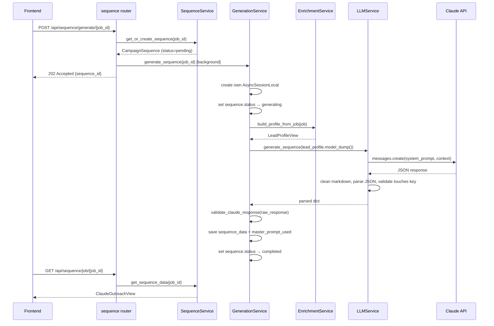
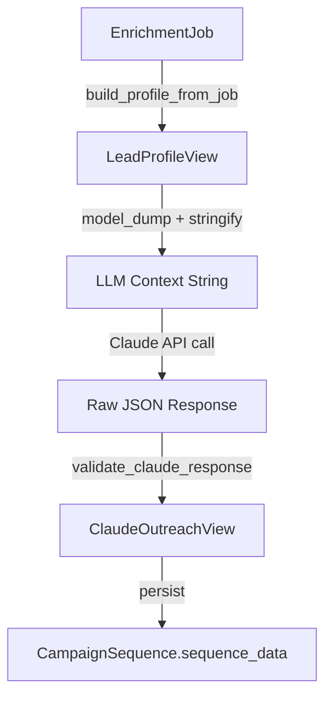
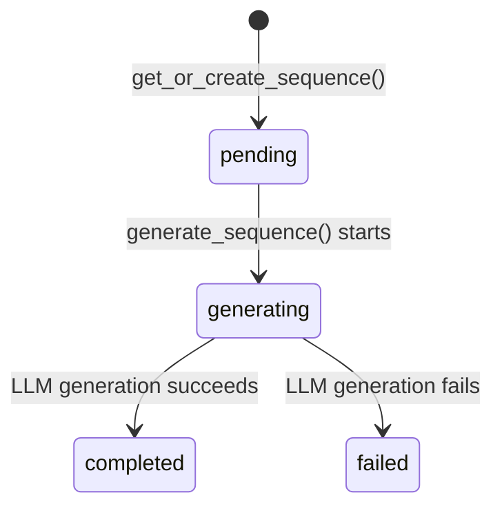

# Sequence Generation Pipeline — API Contract

> Pick a completed enrichment, transform it into a structured lead profile, send it to Claude LLM for hyper-personalized 8-touch email sequence generation, validate the response, and serve the structured sequence to the frontend.

## 1. Web Overview

This pipeline handles the AI-powered content creation phase. When a user triggers sequence generation for a completed enrichment job, the system creates or updates a `CampaignSequence` record, runs the generation as a background task, fetches the enriched lead profile, sends it to Claude with a master system prompt, validates the JSON response, and stores the resulting 8-touch email sequence. The frontend polls for completion and retrieves the structured `ClaudeOutreachView`.



---

## 2. Service Inventory

### SequenceService

I am **SequenceService**. I manage `CampaignSequence` records. I can get or create a sequence for a job, and I retrieve validated sequence data using the `validate_claude_response` transformer.

| Property       | Value                                          |
|----------------|------------------------------------------------|
| Location       | [`backend/app/services/sequence_service.py`](../services/sequence_service.py) |
| Dependencies   | `app.transformers.sequence` (for `validate_claude_response`) |
| Initialization | Requires `AsyncSession` (database session)     |

**Methods I expose:**
- `get_or_create_sequence(job_id: UUID) -> CampaignSequence` — Get existing or create new sequence
- `get_sequence_data(job_id: str) -> ClaudeOutreachView` — Get validated sequence data

---

### GenerationService

I am **GenerationService**. I orchestrate the full email sequence generation pipeline. I create my own database session (not the request-scoped one) so I can run as a background task. I fetch the enrichment job, transform its payloads into a `LeadProfileView` via `EnrichmentService.build_profile_from_job()`, send it to `LLMService` for Claude generation, validate the response, and persist the result as a `CampaignSequence`.

| Property       | Value                                          |
|----------------|------------------------------------------------|
| Location       | [`backend/app/services/generation_service.py`](../services/generation_service.py) |
| Dependencies   | `EnrichmentService` (for `build_profile_from_job`), `LLMService`, `app.transformers.sequence` |
| Initialization | Stateless — creates its own `AsyncSessionLocal` internally |

**Methods I expose:**
- `generate_sequence(job_id: str) -> CampaignSequence` — Generate 8-touch email sequence for a job

---

### LLMService

I am **LLMService**. I am a singleton service that wraps the Anthropic AsyncAnthropic client. I take a structured payload context, stringify it, send it to Claude with the master system prompt, clean up any markdown formatting from the response, parse the JSON, and validate that it contains the required `touches` key.

| Property       | Value                                          |
|----------------|------------------------------------------------|
| Location       | [`backend/app/services/llm_service.py`](../services/llm_service.py) |
| Dependencies   | `app.core.config` (for `anthropic_api_key`)    |
| Initialization | Singleton — global `llm_service` instance      |

**Methods I expose:**
- `generate_sequence(payload_context: dict, model: str = "claude-haiku-4-5") -> dict` — Generate sequence via Claude

---

## 3. Internal API Contracts

### GenerationService → EnrichmentService.build_profile_from_job()

**Purpose:** Fetch the enrichment job and transform its 6 JSONB payloads into a structured LeadProfileView for LLM consumption.

**Input:**

| Parameter | Type            | Required | Description                              |
|-----------|-----------------|----------|------------------------------------------|
| job       | EnrichmentJob   | Yes      | The enrichment job with all 6 payloads   |

**Output:** [`LeadProfileView`](../schemas/enriched_data.py)

| Field            | Type                        | Description                              |
|------------------|-----------------------------|------------------------------------------|
| name             | str                         | Full name of the lead                    |
| current_title    | str                         | Current job title                        |
| location         | str                         | Geographic location (city, country)      |
| linkedin_url     | str \| None                 | URL to LinkedIn profile                  |
| headline         | str \| None                 | Professional headline from profile       |
| summary          | str \| None                 | Profile summary or bio                   |
| recent_experience| List[ExperienceView]        | Most recent work experiences             |
| education        | List[EducationView]         | Educational background                   |
| languages        | List[LanguageView]          | Languages spoken                         |
| company          | CompanyView \| None         | Current company details                  |
| intelligence     | RoleIntelligenceView \| None| Deep intelligence about the role         |

**Preconditions:**
- EnrichmentJob must exist and have all 6 payloads filled (status=completed)

**Errors:**
- Raises `ValueError` if job not found (caught by GenerationService, sets sequence status to failed)

---

### GenerationService → LLMService.generate_sequence()

**Purpose:** Send transformed lead profile data to Claude for 8-touch email sequence generation.

**Input:**

| Parameter        | Type   | Required | Description                                      |
|------------------|--------|----------|--------------------------------------------------|
| payload_context  | dict   | Yes      | LeadProfileView.model_dump() — structured profile |
| model            | str    | No       | Claude model (default: "claude-haiku-4-5")       |

**Output:** `dict` — Raw parsed JSON from Claude

| Field    | Type          | Description                              |
|----------|---------------|------------------------------------------|
| touches  | List[dict]    | Array of 8 outreach touch objects        |
| account_strategy_analysis | dict | Strategic analysis for the sequence |

**Errors:**

| Exception     | Status | Condition                        |
|---------------|--------|----------------------------------|
| HTTPException | 500    | LLM call fails                   |
| HTTPException | 500    | Response cannot be parsed as JSON|
| HTTPException | 500    | Response missing `touches` key   |

---

### GenerationService → `validate_claude_response()` (via transformers)

**Purpose:** Validate raw Claude response dict against `ClaudeOutreachView` Pydantic schema.

**Input:**

| Parameter      | Type | Required | Description                    |
|----------------|------|----------|--------------------------------|
| raw_response   | dict | Yes      | Raw parsed JSON from Claude    |

**Output:** [`ClaudeOutreachView`](../schemas/sequence.py)

| Field                     | Type                    | Description                              |
|---------------------------|-------------------------|------------------------------------------|
| touches                   | List[TouchView]         | Array of 8 outreach touches              |
| account_strategy_analysis | AccountStrategyView     | Overarching strategic analysis           |

**TouchView:**

| Field                 | Type | Description                                    |
|-----------------------|------|------------------------------------------------|
| objective             | str  | Goal of this outreach touch                    |
| touch_number          | int  | Sequential number (1-based)                    |
| example_snippet       | str  | Concrete example email snippet in Spanish      |
| ai_prompt_instruction | str  | Instructions given to the AI for generation    |

**AccountStrategyView:**

| Field                      | Type | Description                                          |
|----------------------------|------|------------------------------------------------------|
| personalization_angle      | str  | High-level strategic angle for approaching the lead  |
| identified_core_pain_point | str  | The central pain point the outreach strategy addresses|

---

## 4. External API Contracts (HTTP Endpoints)

### `POST /api/sequence/generate/{job_id}`

> Generate an 8-touch email sequence for a completed enrichment job.

**Request:**

| Parameter | Location | Type | Required | Description                  |
|-----------|----------|------|----------|------------------------------|
| job_id    | path     | str  | Yes      | Enrichment job ID (UUID str) |

**Success Response:** `202 Accepted`

```json
{
  "job_id": "550e8400-e29b-41d4-a716-446655440000",
  "sequence_id": "660e8400-e29b-41d4-a716-446655440001",
  "status": "accepted",
  "message": "Sequence generation started in background"
}
```

| Field       | Type   | Description                              |
|-------------|--------|------------------------------------------|
| job_id      | string | The enrichment job ID                    |
| sequence_id | string | UUID of the created/updated sequence     |
| status      | string | "accepted"                               |
| message     | string | Human-readable status                    |

**Error Responses:**

| Status | Condition           | Detail Pattern                      |
|--------|---------------------|-------------------------------------|
| 400    | Invalid UUID format | "Invalid job ID format: {job_id}"   |
| 404    | Job not found       | "Enrichment job with ID {job_id} not found" |

**Background Behavior:** Sequence generation runs as a background task. The sequence status transitions through: `pending` → `generating` → `completed` (or `failed`). Poll `GET /api/sequence/job/{job_id}` to check completion. If generation fails, status is set to `failed`.

---

### `GET /api/sequence/job/{job_id}`

> Get the validated sequence data for a job.

**Request:**

| Parameter | Location | Type | Required | Description                  |
|-----------|----------|------|----------|------------------------------|
| job_id    | path     | str  | Yes      | Enrichment job ID (UUID str) |

**Success Response:** `200 OK`

Returns [`ClaudeOutreachView`](../schemas/sequence.py):

| Field                     | Type                    | Description                              |
|---------------------------|-------------------------|------------------------------------------|
| touches                   | List[TouchView]         | Array of 8 outreach touches              |
| account_strategy_analysis | AccountStrategyView     | Strategic analysis for the sequence      |

**Error Responses:**

| Status | Condition                  | Detail Pattern                                    |
|--------|----------------------------|---------------------------------------------------|
| 400    | Invalid UUID format        | "Invalid job ID format: {job_id}"                 |
| 404    | Sequence not found         | "Sequence for job {job_id} not found"             |
| 404    | Data not yet generated     | "Sequence data not yet generated for job {job_id}"|
| 500    | Database/validation fails  | "Failed to fetch sequence data: {error}"          |

---

## 5. Data Flow

### Step-by-step transformation narrative

1. **Trigger** — `POST /api/sequence/generate/{job_id}` creates/updates a `CampaignSequence` with `status="pending"` and returns 202.

2. **Background task starts** — `GenerationService.generate_sequence()` creates its own `AsyncSessionLocal`, sets `status="generating"`, and commits so the frontend sees the status change immediately.

3. **Fetch enrichment data** — The enrichment job is fetched from the database. `EnrichmentService.build_profile_from_job()` transforms the 6 raw JSONB payloads into a structured `LeadProfileView`.

4. **LLM context** — `LeadProfileView.model_dump()` is stringified and sent to Claude with the `MASTER_SYSTEM_PROMPT`.

5. **Claude response** — raw JSON with `touches` array and `account_strategy_analysis` object.

6. **Validation** — `validate_claude_response()` validates the response against `ClaudeOutreachView` Pydantic schema.

7. **Persistence** — The validated `ClaudeOutreachView` is stored in `CampaignSequence.sequence_data` JSONB column. The `MASTER_SYSTEM_PROMPT` is saved in `master_prompt_used` for auditing. Status is set to `completed`.



---

## 6. Status State Machine

### CampaignSequence Status Machine



| From State | To State  | Trigger                                    | Actor                  |
|------------|-----------|--------------------------------------------|------------------------|
| (created)  | pending   | `get_or_create_sequence()` called          | SequenceService        |
| pending    | generating| `generate_sequence()` starts               | GenerationService      |
| generating | completed | LLM call succeeds, response validated      | GenerationService      |
| generating | failed    | LLM call fails or response invalid         | GenerationService      |

---

## 7. Error Contracts

### GenerationService Errors

I handle errors internally and set sequence status to `failed`:

| Condition                    | Behavior                                                      |
|------------------------------|---------------------------------------------------------------|
| EnrichmentJob not found      | Raises `ValueError`, caught by outer try/except, status → failed |
| LLM call fails               | Caught, status → failed, exception re-raised                 |
| Response validation fails    | Caught, status → failed, exception re-raised                 |
| Any other exception          | Caught, status → failed (if sequence exists), exception re-raised |

**Note:** GenerationService does not raise HTTPExceptions directly — it runs as a background task. Errors are logged and the sequence status is set to `failed`.

---

### LLMService Errors

I raise the following errors:

| Status | Condition                    | Detail Pattern                                              | Propagates To |
|--------|------------------------------|-------------------------------------------------------------|---------------|
| 500    | Response not valid JSON      | "Failed to parse LLM response as JSON"                      | GenerationService |
| 500    | Response missing `touches`   | "LLM response missing required 'touches' key"               | GenerationService |
| 500    | Any other LLM failure        | "LLM generation failed: {error}"                            | GenerationService |

---

### SequenceService Errors

I raise the following errors:

| Status | Condition                    | Detail Pattern                                              | Propagates To |
|--------|------------------------------|-------------------------------------------------------------|---------------|
| 400    | Invalid UUID format          | "Invalid job ID format: {job_id}"                           | HTTP response |
| 404    | Job not found                | "Enrichment job with ID {job_id} not found"                 | HTTP response |
| 404    | Sequence not found           | "Sequence for job {job_id} not found"                       | HTTP response |
| 404    | Sequence data not generated  | "Sequence data not yet generated for job {job_id}"          | HTTP response |
| 500    | Database/validation fails    | "Failed to get or create sequence: {error}"                 | HTTP response |
| 500    | Fetch sequence data fails    | "Failed to fetch sequence data: {error}"                    | HTTP response |

---

## 8. Assumptions and Constraints

| Assumption                        | Detail                                                                                      |
|-----------------------------------|---------------------------------------------------------------------------------------------|
| Database session scoping          | SequenceService uses request-scoped `AsyncSession` from `get_db()`. GenerationService creates its own `AsyncSessionLocal` because it runs as a background task after the request session is closed. |
| Background task behavior          | `POST /api/sequence/generate/{job_id}` — LLM generation runs after 202 response. Frontend must poll `GET /api/sequence/job/{job_id}` to check completion. |
| External service dependency       | Anthropic Claude API (sequence generation). Fire-and-forget from the HTTP response perspective. |
| LLM model                         | Default model is `claude-haiku-4-5`. Configurable via `model` parameter in `LLMService.generate_sequence()`. |
| Idempotency                       | `POST /api/sequence/generate/{job_id}` IS idempotent — it updates existing sequence if one exists. |
| Sequence data persistence         | The `MASTER_SYSTEM_PROMPT` is saved in `CampaignSequence.master_prompt_used` for auditing. The validated `ClaudeOutreachView` is stored as JSON in `sequence_data`. |
| Timeout behavior                  | LLM call has no explicit timeout (relies on Anthropic client defaults). |
| Upstream dependency               | This pipeline consumes `LeadProfileView` from the [Enrichment Pipeline](./enrichment_pipeline.md). The enrichment job must have `status=completed` before sequence generation can succeed. |
